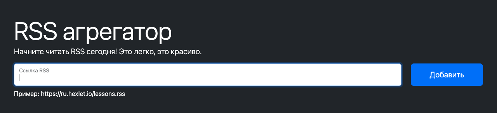

### Hexlet tests and linter status:
[](https://github.com/TeonaGZ/frontend-project-11/actions)
[](https://github.com/TeonaGZ/frontend-project-11/actions)
[](https://codeclimate.com/github/TeonaGZ/frontend-project-11/maintainability)

### Description
It is a service for aggregating RSS feeds. It collects feeds from websites that you'll choose and puts them into one place. It allows you to add an unlimited number of feeds and automatically update them every 5 seconds.

### Set up
```
$ make install
```

### Developer mode:
#### Start
```
$ make develop
```
#### Build
```
$ make build
```
### Link to app
[RSS aggregator](https://frontend-project-11-delta-peach.vercel.app/)
